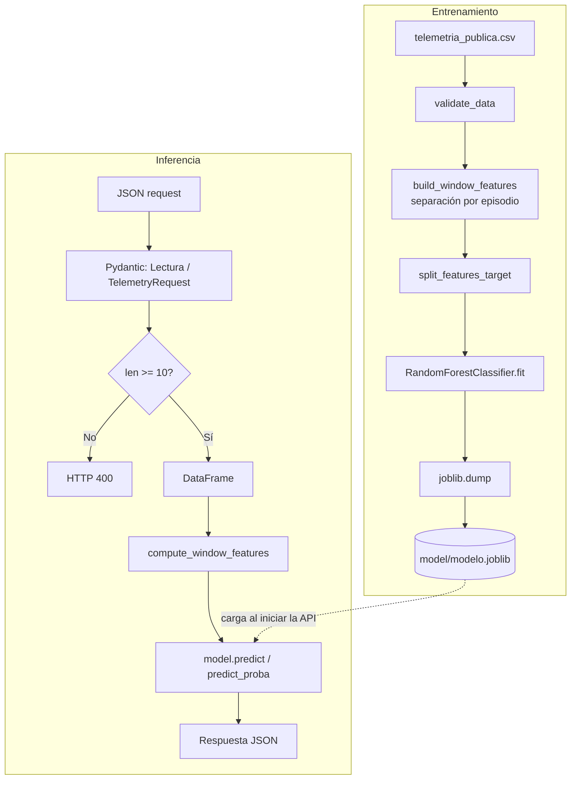

# Detector de Fallas en GPU (NVIDIA L40)

Sistema de clasificación que, a partir de telemetría cruda de una GPU NVIDIA L40, predice uno de cuatro estados operativos: `normal`, `sobrecalentamiento`, `degradacion_memoria` o `falla_alimentacion`. Usa un `RandomForestClassifier` de scikit-learn entrenado sobre features estadísticas calculadas por ventanas de tiempo, y expone el modelo mediante una API con FastAPI.

## Contexto

Cada registro de telemetría cruda (`data/telemetria_publica.csv`) contiene una lectura por segundo con las columnas:

| Columna | Descripción |
|---|---|
| `episodio_id` | Identificador del episodio/GPU al que pertenece la lectura |
| `segundo` | Marca temporal en segundos dentro del episodio |
| `temp_c` | Temperatura (°C) |
| `power_w` | Consumo de potencia (W) |
| `util_pct` | Utilización (%) |
| `clock_mhz` | Frecuencia del reloj (MHz) |
| `ecc_errors` | Errores de memoria ECC |
| `estado` | Etiqueta de estado del episodio (target) |

El modelo no clasifica lecturas individuales: agrupa segundos consecutivos en **ventanas** y clasifica cada ventana.

## Decisión importante sobre las ventanas

`episodio_id` y `segundo` **nunca son features del modelo**:

- `episodio_id` solo se usa para no mezclar segundos de dos GPUs/episodios distintos al construir ventanas.
- `segundo` solo se usa para ordenar las lecturas dentro de un episodio y calcular a qué ventana pertenece cada una (`segundo // WINDOW_SIZE` en [features.py](src/features.py)).
- `estado` es la variable objetivo (`y`) y tampoco es una feature de entrada.

Una ventana siempre pertenece a un único episodio; si un grupo mezclara más de un `estado`, `build_window_features` lanza un `ValueError` (ver [features.py](src/features.py#L100)).

## Feature engineering

Toda la lógica de cálculo de features vive en [src/features.py](src/features.py) y se reutiliza sin duplicación tanto en entrenamiento como en inferencia:

- **`compute_window_features(window)`**: recibe una ventana cruda ya delimitada (un DataFrame con `temp_c`, `power_w`, `util_pct`, `clock_mhz`, `ecc_errors`) y devuelve un `dict` con las features agregadas de esa ventana. No requiere `episodio_id`, `segundo` ni `estado`. Es la función que usa directamente [src/api.py](src/api.py) para inferencia, evitando así tener que inventar `episodio_id`/`segundo` solo para satisfacer la función.
- **`build_window_features(dataframe)`**: orquesta el particionado de un DataFrame completo (con `episodio_id`, `segundo` y `estado`) en ventanas de tamaño `WINDOW_SIZE`, llama a `compute_window_features` por cada ventana y arma el DataFrame final de entrenamiento. Solo se usa durante el entrenamiento (vía [src/preprocessing.py](src/preprocessing.py)).

Las features actualmente implementadas (`FEATURE_NAMES`) son, por cada variable cruda, estadísticas de media, desviación estándar, mínimo, máximo, rango y tendencia (pendiente de una recta ajustada a la ventana); para `ecc_errors` se agregan suma, media, máximo y conteo de lecturas con error:

| Variable | Estadísticas calculadas |
|---|---|
| `temp_c` | mean, std, min, max, range, trend |
| `power_w` | mean, std, min, max, range, trend |
| `util_pct` | mean, std, min, max |
| `clock_mhz` | mean, std, min, max, range, trend |
| `ecc_errors` | sum, mean, max, nonzero_count |

## Arquitectura



## Modelo

Definido en [src/train.py](src/train.py):

```python
RandomForestClassifier(
    random_state=42,
    n_estimators=200,
    n_jobs=1,
)
```

`train_model(X_train, y_train)` ajusta este modelo sobre las features de ventana. El split train/test se hace en [src/main.py](src/main.py) con `train_test_split(X, y, test_size=TEST_SIZE, random_state=RANDOM_STATE, stratify=y)`, con `TEST_SIZE=0.2` y `RANDOM_STATE=42` (definidos en [src/config.py](src/config.py)). El `stratify=y` preserva la proporción de cada estado entre train y test.

### Evaluación

[src/evaluate.py](src/evaluate.py) calcula, sobre el conjunto de test, `accuracy`, `precision`, `recall` y `f1_score` (todas con `average="weighted"` y `zero_division=0`), e imprime los resultados en consola. *Nota: en el código actual no se genera matriz de confusión ni análisis de importancia de features; si se necesitan, son una extensión natural de `evaluate_model` usando `confusion_matrix` y `model.feature_importances_`.*

## Serialización

El entrenamiento y la serialización ocurren en el mismo flujo, dentro de `main()` en [src/main.py](src/main.py): tras evaluar el modelo, se guarda con `joblib.dump(model, MODEL_FILE)` en `model/modelo.joblib` (no existe un módulo `serialize.py` independiente; esa responsabilidad está incluida al final del pipeline de `main.py`).

La API **no entrena** el modelo: al iniciar, [src/api.py](src/api.py) simplemente ejecuta `model = joblib.load(MODEL_FILE)` a nivel de módulo. Esto separa dos ciclos de vida distintos (entrenar es costoso y offline; servir predicciones debe ser rápido y determinístico) y evita que cada reinicio o réplica de la API tenga que reentrenar o pueda producir un modelo ligeramente distinto.

## API

Construida con FastAPI ([src/api.py](src/api.py)). Endpoint principal:

```
POST /predict
```

El contrato de entrada es un modelo Pydantic:

```python
class Lectura(BaseModel):
    temp_c: float
    power_w: float
    util_pct: float
    clock_mhz: float
    ecc_errors: int

class TelemetryRequest(BaseModel):
    lecturas: list[Lectura]
```

Solo se aceptan los campos reales de telemetría (`temp_c`, `power_w`, `util_pct`, `clock_mhz`, `ecc_errors`); `episodio_id`, `segundo` y `estado` no forman parte del contrato de inferencia porque no son necesarios para `compute_window_features`. *Nota: el modelo Pydantic actual no declara `extra="forbid"`, por lo que campos adicionales enviados en el JSON son ignorados en vez de rechazados; declarar `model_config = ConfigDict(extra="forbid")` en `Lectura` haría el contrato más estricto.*

`lecturas` debe tener **como mínimo 10 registros**; si no, la API responde `400 Bad Request` antes de tocar el modelo. Esto evita calcular estadísticas (especialmente `std` y `trend`) sobre ventanas demasiado pequeñas para ser representativas.

La respuesta actual de `/predict` (ver [src/api.py](src/api.py#L46)):

```python
{
    "estado_predicho": prediction,
    "confianza": confidence,
}
```

donde `confianza` es `model.predict_proba(features)` para la clase predicha (`prediction`). El código ya calcula `probability_by_class` (probabilidad por cada clase de `model.classes_`), pero actualmente no se incluye en el `return`; agregarlo es tan simple como sumar esa clave al diccionario de respuesta.

## Estructura del proyecto

```
detector-fallas-gpu/
│
├── data/
│   └── telemetria_publica.csv
│
├── model/
│   └── modelo.joblib
│
├── src/
│   ├── __init__.py
│   ├── config.py         # Rutas y constantes (paths, columnas, hiperparámetros de split)
│   ├── data.py            # Carga del CSV crudo (load_data)
│   ├── schema.py          # Contrato/validación de entrada con Pandera (validate_data)
│   ├── features.py        # Feature engineering reutilizable (compute_window_features, build_window_features)
│   ├── preprocessing.py   # Arma X/y a partir del DataFrame validado (split_features_target)
│   ├── train.py           # Definición y entrenamiento del RandomForestClassifier
│   ├── evaluate.py        # Métricas de evaluación (accuracy, precision, recall, f1)
│   ├── main.py            # Orquesta el pipeline completo de entrenamiento y serializa el modelo
│   └── api.py             # Servicio FastAPI que carga model/modelo.joblib y expone POST /predict
│
├── Dockerfile
├── .dockerignore
├── requirements.txt
└── README.md
```

## Ejemplo de request

```json
POST /predict
{
  "lecturas": [
    { "temp_c": 88.3, "power_w": 296.5, "util_pct": 95.8, "clock_mhz": 2038, "ecc_errors": 0 },
    { "temp_c": 89.8, "power_w": 298.9, "util_pct": 95.4, "clock_mhz": 2091, "ecc_errors": 1 }
  ]
}
```

> El ejemplo se abrevia a 2 lecturas; para que la API responda `200 OK` la lista `lecturas` debe tener al menos 10 elementos.

Respuesta (valores ilustrativos, no resultados reales del modelo):

```json
{
  "estado_predicho": "sobrecalentamiento",
  "confianza": 0.98
}
```

## Ejecución local

```powershell
python -m venv venv
.\venv\Scripts\Activate.ps1
pip install -r requirements.txt

# Entrenar y serializar el modelo (genera model/modelo.joblib)
python .\src\main.py

# Levantar la API
uvicorn src.api:app --reload
```

La API queda disponible en [http://127.0.0.1:8000](http://127.0.0.1:8000) y la documentación interactiva (Swagger) en [http://127.0.0.1:8000/docs](http://127.0.0.1:8000/docs). Desde Swagger, expande `POST /predict`, usa "Try it out", pega un JSON como el del ejemplo anterior (con al menos 10 lecturas) y ejecuta la petición.

## Docker

```bash
docker build -t detector-gpu .
docker run -p 8000:8000 detector-gpu
```

El `Dockerfile` instala `requirements.txt`, copia `src/` y `model/` (el modelo debe estar ya entrenado y presente en `model/modelo.joblib` antes de construir la imagen, ya que la API no entrena) y arranca `uvicorn src.api:app --host 0.0.0.0 --port 8000`. La API queda disponible en [http://localhost:8000/docs](http://localhost:8000/docs).

## Decisiones de diseño

1. **Features agregadas por ventana en vez de telemetría cruda fila a fila**: un Random Forest sobre lecturas individuales no captura tendencias ni variabilidad a lo largo del tiempo (p. ej. una caída progresiva de `power_w`); agregar por ventana (media, std, min, max, range, trend) resume esa dinámica en un vector fijo de features por instancia.
2. **`episodio_id`, `segundo` y `estado` no son features**: son metadatos de identificación/orden y la etiqueta objetivo, respectivamente. Incluirlos como entrada del modelo introduciría fuga de información (`estado`) o correlaciones espurias sin valor predictivo real (`episodio_id`, `segundo`).
3. **Lógica de features centralizada en `features.py`**: entrenamiento e inferencia deben transformar la telemetría cruda exactamente igual; tener una única fuente de verdad evita que ambos caminos diverjan silenciosamente.
4. **La API recibe datos crudos y calcula features internamente**: así el cliente de la API solo necesita enviar telemetría real, sin conocer el detalle de cómo se transforma en features; además reutiliza `compute_window_features` sin duplicar código.
5. **El modelo se serializa antes de levantar la API**: separa el ciclo de entrenamiento (costoso, offline, requiere el dataset completo) del ciclo de servicio (debe responder rápido y de forma consistente); la API solo carga un artefacto ya validado.
6. **Mínimo de 10 registros por ventana**: estadísticas como `std` o `trend` no son confiables (o directamente no aportan información, como `trend` con 1 punto) calculadas sobre muestras muy pequeñas.
7. **Uso de `predict_proba()` además de `predict()`**: `predict()` solo da la clase más probable; `predict_proba()` permite exponer qué tan segura está el modelo de esa predicción (`confianza`), información relevante para decidir si una alerta amerita revisión humana.
8. **Entrenamiento e inferencia usan las mismas transformaciones**: ambos llaman funciones de [features.py](src/features.py) (`build_window_features` internamente usa `compute_window_features`, y la API usa `compute_window_features` directamente); no existen dos implementaciones paralelas del cálculo de features.

## Prevención de data leakage

- `estado` nunca se usa como feature: `split_features_target` selecciona explícitamente `FEATURE_NAMES` para `X` y separa `TARGET_COLUMN` para `y`.
- `episodio_id` y `segundo` nunca entran como feature: no forman parte de `FEATURE_NAMES` ni del payload que recibe la API.
- Las ventanas no mezclan episodios: `build_window_features` agrupa por `(episodio_id, segundo // WINDOW_SIZE)` y valida que cada ventana tenga un único `estado`.
- La validación de esquema (`validate_data`, [src/schema.py](src/schema.py)) se ejecuta antes de construir features, rechazando datos crudos que no cumplan los rangos y tipos esperados.
- Entrenamiento e inferencia comparten la misma función de cálculo de features (`compute_window_features`), evitando que ambos caminos calculen estadísticas de forma distinta.
